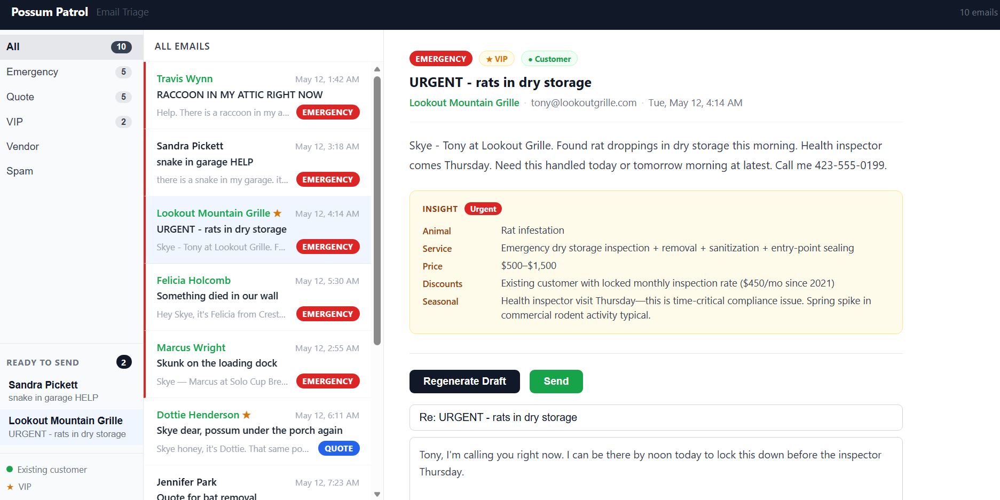

# Possum Patrol: Email Triage Dashboard

AI-powered email triage tool for Skye, owner of Possum Patrol Pest Control in Chattanooga, TN. Processes the inbox, classifies emails, surfaces job insights, and drafts replies, all grounded in the business's own institutional knowledge.



## Features

- **Streaming triage** — classifies up to 100 emails on load via SSE; results render as they arrive
- **Three-column layout** — category sidebar, email list, detail panel
- **Insight cards** — auto-generated for Emergency, Quote, and VIP emails on open; includes animal type, recommended service, price range, applicable discounts, and seasonal flags
- **Draft replies** — one-click drafts written in Skye's voice, informed by the insight card when available
- **Ready to Send** — sidebar section tracking emails with generated drafts; clicking jumps straight to the draft
- **Existing customer detection** — senders matched against `customers.csv` at startup; shown in green throughout the UI
- **VIP and blocklist awareness** — Marshall's notes are embedded in every Claude call as cached context

## Setup

Requirements: Node.js 20+, an Anthropic API key.

```bash
# from possum-patrol/
npm install
```

Create `server/.env.example` with:

```
ANTHROPIC_API_KEY=your_key_here
```

```bash
npm run dev
```

Frontend: `http://localhost:5173`
Backend: `http://localhost:3001`

## Implementation

**Monorepo** — npm workspaces with a `client/` (React + Vite) and `server/` (Express) package. `concurrently` runs both dev servers from the root.

**Triage** — single forced tool call per email (`tool_choice: { type: "tool", name: "submit_triage" }`). Marshall's notes, `customers.csv`, and `services.md` are embedded in the system prompt as a single cached prefix. Emails 2-100 in a batch reuse the cached tokens at roughly 10% of write cost.

**Quote** — agentic loop with two read-only tools (`get_services`, `get_customer_rules`). Claude decides what to look up, then calls `submit_quote` with the structured insight card.

**Draft** — single forced call. If an insight card exists for the email, it is injected into the user message as plain-text context before Claude writes the reply.

**Structured output** — all three endpoints use a tool `input_schema` for structured output. No JSON parsing, no markdown fence handling.

**Customer lookup** — `customers.csv` is parsed once at server startup into two `Set` objects (emails, names). The `is_existing_customer` flag is attached to every triage result at zero additional API cost.

**Draft persistence** — draft, quote, and sent state all live in `App.jsx` keyed by `email_id`. Tab switches unmount list items but never lose state.

## Things worth noting

- Marshall's handwritten notes are the primary source of business logic for the AI: VIP tiers, blocklist, seasonal patterns, vendor relationships, and pricing philosophy. They are a text file, not a database, and Claude reads them whole on every call via the cached system prompt.
- The Ready to Send list is derived state with no extra storage: `emails.filter(e => drafts[e.email_id] && !sentIds[e.email_id])`.
- The VIP tab matches on the `is_vip` flag, not just `category === "VIP"`, so a VIP customer with an emergency appears in both tabs.
- Haiku 4.5 handles all three AI tasks. Triage and draft each cost roughly one cached read after warmup. Quote costs a bit more due to the tool-use loop, typically 2-3 rounds.

## Future work
